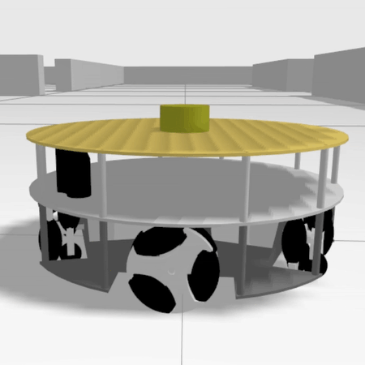
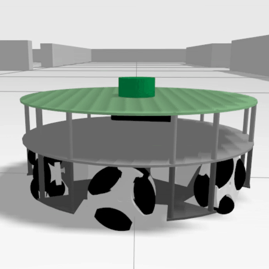

<!--
Copyright (c) 2026 Francisco Martín Rico
SPDX-License-Identifier: Apache-2.0
-->

# EasyNav Omni Playground

Gazebo Harmonic simulation of three- to six-wheel omnidirectional robots, integrated with EasyNav. The default launch starts the `3w_v2` robot in `maze2`, together with EasyNav and RViz2.

## Demo

[](https://youtu.be/8tPknIoeD1M)

## Supported ROS 2 distributions

This playground needs Gazebo Harmonic or newer, so it runs on Jazzy and later distributions, but not on Humble, whose Gazebo is Fortress. EasyNav itself (core and plugins) does run on Humble: only this simulation does not.

## Build

From the ROS 2 workspace root:

```bash
rosdep install --from-paths src --ignore-src -r -y
colcon build --symlink-install --packages-up-to easynav_playground_omni
source install/setup.bash
```

## Launch EasyNav

```bash
ros2 launch easynav_playground_omni easynav_navigation_gazebo_sim.launch.yaml
```

The `world` launch argument selects both the Gazebo world and its matching EasyNav map. The available options are `maze1` and `maze2` (default):

```bash
ros2 launch easynav_playground_omni easynav_navigation_gazebo_sim.launch.yaml world:=maze1
```

```bash
ros2 launch easynav_playground_omni easynav_navigation_gazebo_sim.launch.yaml world:=maze2
```

Other launch arguments, `params_file`, `rviz_config`, and `map_override_file`, can also be overridden.

## Choose a robot

Choose a robot with the `robot` launch argument. The available IDs and previews are:

| `3w` | `3w_v2` (default) | `4w` | `5w` | `6w` |
| --- | --- | --- | --- | --- |
|  |  |  |  |  |

All robot models share EasyNav limits of 0.6 m/s linear and 0.5 rad/s angular velocity. The simulated wheel command limits are set to ±35 rad/s to support that linear speed; the controller may still slow down for turns, obstacles, and goal approach.

For example, launch a robot with EasyNav in either world:

```bash
ros2 launch easynav_playground_omni easynav_navigation_gazebo_sim.launch.yaml robot:=5w world:=maze1
```

```bash
ros2 launch easynav_playground_omni easynav_navigation_gazebo_sim.launch.yaml robot:=6w world:=maze2
```

To run only Gazebo and the robot, without EasyNav or RViz2:

```bash
ros2 launch easynav_playground_omni gazebo_sim.launch.yaml robot:=4w world:=maze2
```

## Attribution and licensing

The original simulator and robot assets are by [Yohan Prakoso](https://github.com/YePeOn7/ros2_omni_robot_sim). The original MIT license and copyright notice are preserved in [LICENSE](./LICENSE). EasyNav integration contributions by Francisco Martín Rico are licensed under Apache-2.0; see [LICENSE-APACHE](./LICENSE-APACHE).
